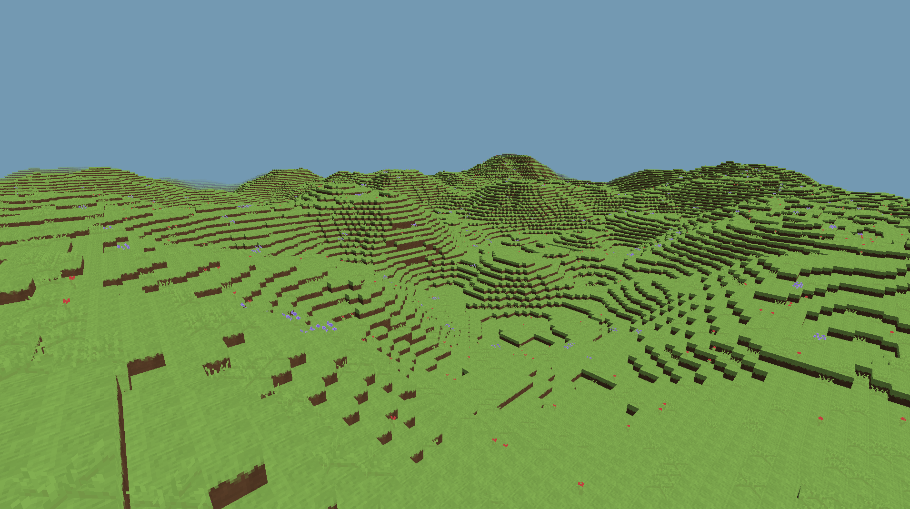

# Nanocraft
My own take on creating voxel engine.\ 
Made using C++ and OpenGL framework.

#### Features
 - Proceduraly generated world
 - Diffrent blocks and plants
 - Code optimized for multithreading
 - (Project is still in work)
#### Building
##### On Unix like operating system
`cmake -S . -B build/`\
`cd build`\
`make`\
If you want to move executable to another folder\
Remember to copy `resources/` as well
##### On Windows
I haven’t tried running this project on Windows yet.
#### Technical Info
This project was created as a personal challenge\
to learn more about graphics programming and optimization.\
All code was written entirely by me, without using AI models\
(except for debugging assistance).
##### Libraries used in probject
- [GLFW](https://www.glfw.org/)
- [GL3W](https://github.com/skaslev/gl3w)
- [GLM](https://github.com/g-truc/glm)
- [stb](https://github.com/nothings/stb)